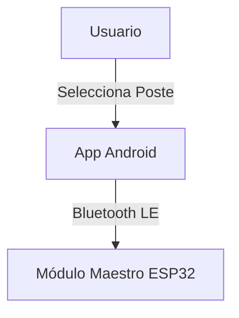
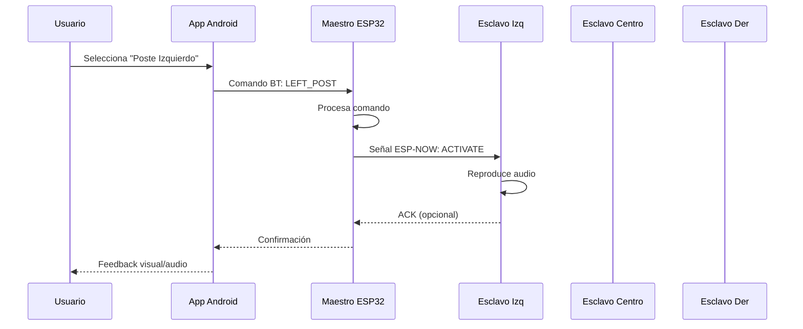
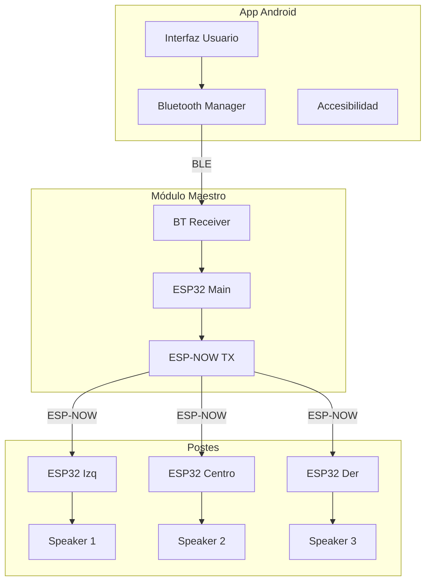

import { Callout } from 'fumadocs-ui/components/callout';

## Visión General de la Arquitectura

El sistema GITAF está compuesto por tres componentes principales que trabajan de manera integrada para proporcionar orientación audible a los deportistas:

### 1. Capa de Aplicación (Android App)

La aplicación móvil actúa como **interfaz de control** del sistema. Sus responsabilidades incluyen:

- **Selección de Poste**: Interfaz para elegir entre Izquierdo, Central o Derecho
- **Gestión de Conexión**: Escaneo y conexión Bluetooth con el módulo maestro
- **Accesibilidad**: Soporte completo para TalkBack y diseño de alto contraste
- **Feedback Visual/Audio**: Confirmación de acciones para el usuario

### 2. Capa de Procesamiento (Módulo Maestro)

El **ESP32 Principal** funciona como cerebro central del sistema:

- **Receptor Bluetooth**: Recibe comandos de la aplicación móvil
- **Procesador de Comandos**: Interpreta las instrucciones del usuario
- **Transmisor ESP-NOW**: Envía señales al poste correspondiente
- **Gestión de Estado**: Mantiene el estado actual del sistema

<Callout type="info">
El módulo maestro utiliza **ESP-NOW** en lugar de WiFi tradicional para lograr:
- Menor latencia en la comunicación
- Menor consumo de energía
- Mayor alcance en espacios abiertos
</Callout>

### 3. Capa de Actuación (Módulos Esclavos)

Cada poste cuenta con un **Módulo ESP32 Esclavo** independiente:

- **Receptor ESP-NOW**: Escucha señales del maestro
- **Control de Audio**: Activa/desactiva el altavoz
- **Gestión de Batería**: Monitoreo de carga y bajo consumo
- **Identificador Único**: Cada módulo tiene su dirección MAC única

## Flujo de Comunicación

## Arquitectura de Red

### Topología Estrella

El sistema utiliza una topología en **estrella**, donde el módulo maestro es el nodo central:

- **Ventajas**:
  - Fallo de un esclavo no afecta a los demás
  - Fácil agregar o quitar postes
  - Troubleshooting simplificado
  - Control centralizado

- **Desafíos Resueltos**:
  - Sincronización mediante identificadores únicos
  - Manejo de colisiones de paquetes
  - Retry automático en caso de pérdida de señal

## Protocolos de Comunicación

### Bluetooth Low Energy (BLE)

**Usado entre**: App ↔ Maestro

- **Perfil**: GATT (Generic Attribute Profile)
- **Servicios Personalizados**: Control de postes
- **Características**: READ/WRITE/NOTIFY
- **Alcance**: ~10 metros
- **Consumo**: Ultra bajo en modo standby

### ESP-NOW

**Usado entre**: Maestro ↔ Esclavos

- **Capa**: Data Link (MAC)
- **Velocidad**: 1 Mbps
- **Alcance**: Hasta 200m en campo abierto
- **Encriptación**: AES-128 (opcional)
- **Latencia**: &lt;10ms

<Callout type="warn">
ESP-NOW opera en el mismo canal 2.4GHz que WiFi. Asegúrate de usar canales no congestionados para mejor rendimiento.
</Callout>

## Consideraciones de Diseño

### Escalabilidad

El sistema está diseñado para ser escalable:

- **Horizontal**: Agregar más postes (hasta 20 dispositivos ESP-NOW)
- **Vertical**: Mejorar potencia de señal o agregar repetidores
- **Funcional**: Agregar nuevos patrones de audio o modos de entrenamiento

### Confiabilidad

Mecanismos implementados:

- **Watchdog Timer**: Reinicio automático en caso de bloqueo
- **Redundancia de Mensajes**: Envío múltiple de comandos críticos
- **Estado de Batería**: Alertas preventivas de batería baja
- **Logging**: Registro de eventos para debugging

### Seguridad

- **Emparejamiento Bluetooth**: Autenticación antes de conectar
- **Lista Blanca MAC**: Solo dispositivos autorizados pueden comunicarse
- **Timeout de Sesión**: Desconexión automática por inactividad

## Diagrama de Componentes

## Próximos Pasos

- Revisa la [Lista de Componentes](/docs/hardware/components) para conocer el hardware específico
- Aprende sobre [Configuración del Firmware](/docs/firmware/setup) para programar los ESP32
- Explora la [Aplicación Móvil](/docs/mobile) para entender la interfaz de usuario
