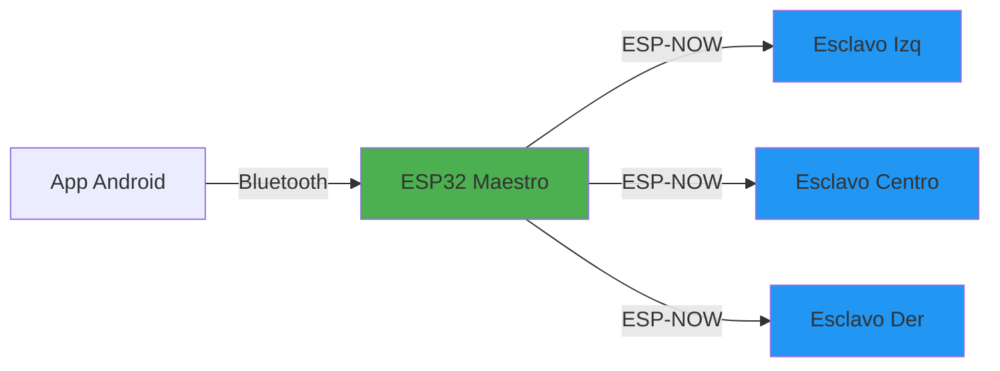

import { Callout } from 'fumadocs-ui/components/callout';
import { Steps, Step } from 'fumadocs-ui/components/steps';

## ¿Qué es ESP-NOW?

ESP-NOW es un protocolo de comunicación inalámbrica desarrollado por Espressif que permite:

- **Ultra Baja Latencia**: &lt;10ms típicamente
 **Sin Router**: Comunicación directa peer-to-peer
- ⚡ **Bajo Consumo**: Menor que WiFi tradicional
-**Largo Alcance**: Hasta 200m en campo abierto
-**Seguro**: Encriptación opcional AES-128

### Comparación con Otros Protocolos

| Característica | ESP-NOW | WiFi | Bluetooth Classic | BLE |
|----------------|---------|------|-------------------|-----|
| Latencia | &lt;10ms | 50-100ms | 100ms | 20-50ms |
| Alcance | 200m | 100m | 10m | 50m |
| Consumo | Bajo | Alto | Medio | Muy Bajo |
| Throughput | 250 Kbps | 150 Mbps | 2 Mbps | 1 Mbps |
| Setup | Instantáneo | Red requerida | Pairing | Pairing |

<Callout type="info">
Para GITAF, ESP-NOW es ideal porque necesitamos baja latencia y no requerimos gran ancho de banda.
</Callout>

## Arquitectura de Red ESP-NOW



### Roles de los Dispositivos

**Maestro (Controller)**:
- Inicia la comunicación
- Envía comandos a esclavos específicos
- No retransmite (comunicación directa)

**Esclavos (Slaves)**:
- Solo escuchan comandos
- Ejecutan acciones basadas en mensajes
- Opcionalmente envían ACK al maestro

## Implementación Paso a Paso

### 1. Estructura de Datos

Define el mensaje que se enviará:

```cpp
// Estructura del mensaje ESP-NOW
typedef struct gitaf_message {
  uint8_t deviceID;      // ID del esclavo destino
  uint8_t command;       // Comando a ejecutar
  uint16_t duration;     // Duración en ms
  uint8_t volume;        // Volumen 0-255
  uint32_t timestamp;    // Para sincronización
  uint8_t checksum;      // Verificación de integridad
} gitaf_message;

// Comandos disponibles
enum Commands {
  CMD_STOP = 0,
  CMD_PLAY_AUDIO = 1,
  CMD_PING = 2,
  CMD_STATUS_REQUEST = 3,
  CMD_SHUTDOWN = 4
};

// IDs de dispositivos
enum DeviceIDs {
  DEVICE_MASTER = 0,
  DEVICE_LEFT = 1,
  DEVICE_CENTER = 2,
  DEVICE_RIGHT = 3
};
```

<Callout type="warn">
El tamaño máximo de un mensaje ESP-NOW es **250 bytes**. Nuestra estructura usa solo ~12 bytes, dejando margen para expansión futura.
</Callout>

### 2. Inicialización ESP-NOW (Maestro)

```cpp
#include <esp_now.h>
#include <WiFi.h>

// Direcciones MAC de los esclavos (obtenerlas con WiFi.macAddress())
uint8_t slaveLeftMAC[] = {0x24, 0x6F, 0x28, 0xAB, 0xCD, 0xEF};
uint8_t slaveCenterMAC[] = {0x24, 0x6F, 0x28, 0x12, 0x34, 0x56};
uint8_t slaveRightMAC[] = {0x24, 0x6F, 0x28, 0x78, 0x9A, 0xBC};

// Callback when data is sent
void OnDataSent(const uint8_t *mac_addr, esp_now_send_status_t status) {
  Serial.print("Envío a: ");
  printMACAddress(mac_addr);
  Serial.print(" | Estado: ");
  Serial.println(status == ESP_NOW_SEND_SUCCESS ? "Éxito" : "Fallo");
}

void initESPNOW() {
  // Configurar WiFi en modo estación
  WiFi.mode(WIFI_STA);
  WiFi.disconnect();  // Asegurar que no intenta conectarse a red
  
  Serial.print("Mi dirección MAC: ");
  Serial.println(WiFi.macAddress());
  
  // Inicializar ESP-NOW
  if (esp_now_init() != ESP_OK) {
    Serial.println("Error inicializando ESP-NOW");
    return;
  }
  
  Serial.println("ESP-NOW inicializado");
  
  // Registrar callback de envío
  esp_now_register_send_cb(OnDataSent);
  
  // Añadir peers (esclavos)
  addPeer(slaveLeftMAC, "Izquierdo");
  addPeer(slaveCenterMAC, "Centro");
  addPeer(slaveRightMAC, "Derecho");
}

void addPeer(uint8_t *peerMAC, const char *name) {
  esp_now_peer_info_t peerInfo = {};
  memcpy(peerInfo.peer_addr, peerMAC, 6);
  peerInfo.channel = 0;  // Canal actual
  peerInfo.encrypt = false;  // Sin encriptación (opcional)
  
  if (esp_now_add_peer(&peerInfo) != ESP_OK) {
    Serial.print("Error añadiendo peer: ");
    Serial.println(name);
    return;
  }
  
  Serial.print("Peer añadido: ");
  Serial.println(name);
}

void printMACAddress(const uint8_t *mac) {
  for (int i = 0; i < 6; i++) {
    Serial.printf("%02X", mac[i]);
    if (i < 5) Serial.print(":");
  }
}
```

### 3. Enviar Comandos (Maestro)

```cpp
void sendCommand(uint8_t targetDevice, uint8_t cmd, uint16_t duration = 1000, uint8_t vol = 128) {
  gitaf_message msg;
  msg.deviceID = targetDevice;
  msg.command = cmd;
  msg.duration = duration;
  msg.volume = vol;
  msg.timestamp = millis();
  msg.checksum = calculateChecksum(&msg);
  
  uint8_t *targetMAC;
  const char *deviceName;
  
  // Seleccionar MAC del dispositivo objetivo
  switch(targetDevice) {
    case DEVICE_LEFT:
      targetMAC = slaveLeftMAC;
      deviceName = "Izquierdo";
      break;
    case DEVICE_CENTER:
      targetMAC = slaveCenterMAC;
      deviceName = "Centro";
      break;
    case DEVICE_RIGHT:
      targetMAC = slaveRightMAC;
      deviceName = "Derecho";
      break;
    default:
      Serial.println("Dispositivo inválido");
      return;
  }
  
  // Enviar mensaje
  esp_err_t result = esp_now_send(targetMAC, (uint8_t *)&msg, sizeof(msg));
  
  if (result == ESP_OK) {
    Serial.print("Comando enviado a: ");
    Serial.println(deviceName);
  } else {
    Serial.println("Error enviando comando");
  }
}

// Función auxiliar para calcular checksum
uint8_t calculateChecksum(gitaf_message *msg) {
  uint8_t sum = 0;
  sum += msg->deviceID;
  sum += msg->command;
  sum += (msg->duration >> 8) + (msg->duration & 0xFF);
  sum += msg->volume;
  return ~sum;  // Complemento
}
```

### 4. Inicialización ESP-NOW (Esclavo)

```cpp
#include <esp_now.h>
#include <WiFi.h>

#define MY_DEVICE_ID DEVICE_LEFT  // Cambiar según el esclavo

// Callback cuando se recibe data
void OnDataRecv(const uint8_t *mac, const uint8_t *incomingData, int len) {
  gitaf_message msg;
  memcpy(&msg, incomingData, sizeof(msg));
  
  // Verificar checksum
  if (msg.checksum != calculateChecksum(&msg)) {
    Serial.println("Checksum inválido - mensaje corrupto");
    return;
  }
  
  // Verificar que el mensaje es para este dispositivo
  if (msg.deviceID != MY_DEVICE_ID) {
    Serial.println("Mensaje no es para mí");
    return;
  }
  
  Serial.print("Comando recibido: ");
  Serial.println(msg.command);
  
  // Procesar comando
  handleCommand(msg);
}

void initESPNOWSlave() {
  // Configurar WiFi
  WiFi.mode(WIFI_STA);
  WiFi.disconnect();
  
  Serial.print("Mi MAC: ");
  Serial.println(WiFi.macAddress());
  
  // Inicializar ESP-NOW
  if (esp_now_init() != ESP_OK) {
    Serial.println("Error ESP-NOW");
    return;
  }
  
  // Registrar callback de recepción
  esp_now_register_recv_cb(OnDataRecv);
  
  Serial.println("Esclavo listo para recibir");
}

void handleCommand(gitaf_message msg) {
  switch(msg.command) {
    case CMD_PLAY_AUDIO:
      playAudio(msg.duration, msg.volume);
      break;
      
    case CMD_STOP:
      stopAudio();
      break;
      
    case CMD_PING:
      Serial.println("PING recibido");
      blinkLED();
      break;
      
    case CMD_STATUS_REQUEST:
      sendStatus();
      break;
      
    case CMD_SHUTDOWN:
      shutdownDevice();
      break;
      
    default:
      Serial.println("Comando desconocido");
  }
}
```

### 5. Respuestas de Esclavos (Opcional)

Los esclavos pueden enviar mensajes de vuelta al maestro:

```cpp
// En el esclavo
void sendStatus() {
  gitaf_message response;
  response.deviceID = MY_DEVICE_ID;
  response.command = CMD_STATUS_REQUEST;
  response.volume = readBatteryLevel();  // 0-100%
  response.timestamp = millis();
  response.checksum = calculateChecksum(&response);
  
  // Obtener MAC del maestro desde el último mensaje recibido
  uint8_t masterMAC[] = {0x24, 0x6F, 0x28, 0xXX, 0xXX, 0xXX};
  
  esp_now_send(masterMAC, (uint8_t *)&response, sizeof(response));
}

// En el maestro - registrar callback de recepción
void OnDataRecvMaster(const uint8_t *mac, const uint8_t *incomingData, int len) {
  gitaf_message msg;
  memcpy(&msg, incomingData, sizeof(msg));
  
  Serial.print("Respuesta de dispositivo ");
  Serial.print(msg.deviceID);
  Serial.print(" | Batería: ");
  Serial.print(msg.volume);
  Serial.println("%");
}
```

## Optimizaciones de Rendimiento

### Reducir Latencia

```cpp
// Aumentar prioridad de tareas WiFi
void optimizeLatency() {
  // Desactivar power saving de WiFi
  esp_wifi_set_ps(WIFI_PS_NONE);
  
  // Configurar canal fijo (evita escaneo)
  esp_wifi_set_channel(1, WIFI_SECOND_CHAN_NONE);
}
```

### Manejo de Congestión

```cpp
// Retry automático con backoff exponencial
void sendCommandWithRetry(uint8_t device, uint8_t cmd, int maxRetries = 3) {
  int retryDelay = 10;
  
  for (int attempt = 0; attempt < maxRetries; attempt++) {
    esp_err_t result = sendCommand(device, cmd);
    
    if (result == ESP_OK) {
      return;  // Éxito
    }
    
    Serial.print("Reintento ");
    Serial.print(attempt + 1);
    Serial.print("/");
    Serial.println(maxRetries);
    
    delay(retryDelay);
    retryDelay *= 2;  // Backoff exponencial
  }
  
  Serial.println("Falló después de todos los reintentos");
}
```

### Broadcast (Envío Múltiple)

Para enviar el mismo comando a todos los esclavos:

```cpp
void broadcastCommand(uint8_t cmd) {
  // Dirección broadcast
  uint8_t broadcastMAC[] = {0xFF, 0xFF, 0xFF, 0xFF, 0xFF, 0xFF};
  
  gitaf_message msg;
  msg.deviceID = 0xFF;  // Todos los dispositivos
  msg.command = cmd;
  msg.timestamp = millis();
  msg.checksum = calculateChecksum(&msg);
  
  esp_now_send(broadcastMAC, (uint8_t *)&msg, sizeof(msg));
}

// En esclavos - aceptar broadcast
void OnDataRecv(const uint8_t *mac, const uint8_t *incomingData, int len) {
  gitaf_message msg;
  memcpy(&msg, incomingData, sizeof(msg));
  
  if (msg.deviceID == MY_DEVICE_ID || msg.deviceID == 0xFF) {
    handleCommand(msg);
  }
}
```

<Callout type="info">
El broadcast es útil para comandos de emergencia como "apagar todo" o sincronización global.
</Callout>

## Seguridad y Encriptación

### Habilitar Encriptación

```cpp
void addEncryptedPeer(uint8_t *peerMAC, const char *name) {
  esp_now_peer_info_t peerInfo = {};
  memcpy(peerInfo.peer_addr, peerMAC, 6);
  peerInfo.channel = 0;
  peerInfo.encrypt = true;  // Habilitar encriptación
  
  // Establecer clave (LMK - Local Master Key)
  uint8_t kok[16] = {
    0x00, 0x01, 0x02, 0x03, 0x04, 0x05, 0x06, 0x07,
    0x08, 0x09, 0x0A, 0x0B, 0x0C, 0x0D, 0x0E, 0x0F
  };
  
  memcpy(peerInfo.lmk, kok, 16);
  
  if (esp_now_add_peer(&peerInfo) != ESP_OK) {
    Serial.println("Error añadiendo peer encriptado");
    return;
  }
  
  Serial.print("Peer encriptado: ");
  Serial.println(name);
}
```

<Callout type="warn">
La encriptación reduce ligeramente el throughput y aumenta latencia ~2-3ms. Evalúa si es necesaria para tu caso de uso.
</Callout>

## Troubleshooting

### Error "ESP_ERR_ESPNOW_NOT_INIT"

```cpp
// Asegúrate de inicializar WiFi ANTES de ESP-NOW
WiFi.mode(WIFI_STA);
delay(100);
esp_now_init();
```

### Mensajes No se Reciben

**Verifica**:
1. Ambos dispositivos en mismo canal WiFi
2. Direcciones MAC correctas
3. WiFi en modo STA en ambos
4. Callback registrado correctamente

```cpp
// Debug: Imprimir canal actual
void printCurrentChannel() {
  uint8_t primaryChan;
  wifi_second_chan_t secondChan;
  esp_wifi_get_channel(&primaryChan, &secondChan);
  Serial.print("Canal actual: ");
  Serial.println(primaryChan);
}
```

### Alcance Limitado

**Soluciones**:
```cpp
// Aumentar potencia de transmisión
esp_wifi_set_max_tx_power(84);  // Max: 84 (20dBm)

// Usar antena externa (si está disponible)
esp_wifi_set_ant_gpio(...);
```

## Testing y Diagnóstico

### Test de Latencia

```cpp
void testLatency() {
  unsigned long start = micros();
  sendCommand(DEVICE_LEFT, CMD_PING);
  // Esperar respuesta...
  unsigned long end = micros();
  
  Serial.print("Latencia: ");
  Serial.print((end - start) / 1000.0);
  Serial.println(" ms");
}
```

### Monitor de Paquetes

```cpp
uint32_t packetsReceived = 0;
uint32_t packetsLost = 0;
uint32_t lastSeq = 0;

void monitorPackets(gitaf_message msg) {
  packetsReceived++;
  
  // Detectar pérdida por salto en secuencia
  if (msg.timestamp > lastSeq + 1) {
    packetsLost += (msg.timestamp - lastSeq - 1);
  }
  
  lastSeq = msg.timestamp;
  
  // Estadísticas cada 100 paquetes
  if (packetsReceived % 100 == 0) {
    float lossRate = (packetsLost / (float)(packetsReceived + packetsLost)) * 100;
    Serial.print("Paquetes recibidos: ");
    Serial.print(packetsReceived);
    Serial.print(" | Perdidos: ");
    Serial.print(packetsLost);
    Serial.print(" | Tasa pérdida: ");
    Serial.print(lossRate);
    Serial.println("%");
  }
}
```

## Ejemplo Completo: Maestro

```cpp
#include <esp_now.h>
#include <WiFi.h>
#include "config.h"

void setup() {
  Serial.begin(115200);
  Serial.println("\n=== GITAF Master ===");
  
  initESPNOW();
  
  Serial.println("Sistema listo");
}

void loop() {
  // Simular comandos (en producción vendrían del Bluetooth)
  static unsigned long lastCommand = 0;
  unsigned long now = millis();
  
  if (now - lastCommand > 3000) {
    // Alternar entre postes cada 3 segundos
    static uint8_t currentPost = DEVICE_LEFT;
    
    sendCommand(currentPost, CMD_PLAY_AUDIO, 1000, 200);
    
    currentPost++;
    if (currentPost > DEVICE_RIGHT) currentPost = DEVICE_LEFT;
    
    lastCommand = now;
  }
  
  delay(100);
}
```

## Próximos Pasos

- Implementa la [Lógica de Audio](/docs/firmware/audio) para los esclavos
- Conecta con [Bluetooth](/docs/mobile) desde la app Android
- Consulta [Troubleshooting](/docs/support/troubleshooting) para problemas comunes

## Recursos

- [ESP-NOW Official Docs](https://docs.espressif.com/projects/esp-idf/en/latest/esp32/api-reference/network/esp_now.html)
- [ESP-NOW Arduino Examples](https://github.com/espressif/arduino-esp32/tree/master/libraries/ESP32/examples/ESPNow)
- [Random Nerd Tutorials ESP-NOW](https://randomnerdtutorials.com/esp-now-esp32-arduino-ide/)
