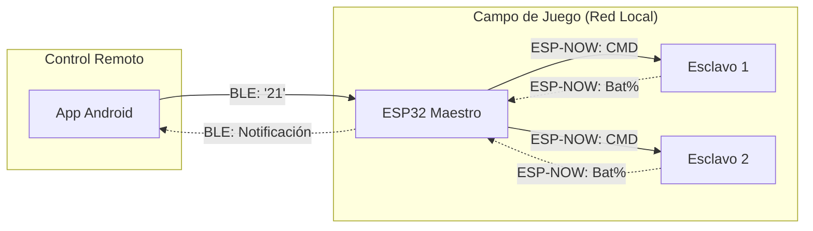

import { Callout } from 'fumadocs-ui/components/callout';

## Protocolo Híbrido de Comunicación

GITAF PRO no depende de una sola tecnología. Para lograr el equilibrio perfecto entre **control de usuario** y **rendimiento en campo**, el sistema implementa una arquitectura de red híbrida.


### Comparativa de Tecnologías Utilizadas

| Característica | Bluetooth Low Energy (BLE) | ESP-NOW |
| :--- | :--- | :--- |
| **Rol en GITAF** | Enlace App Móvil $\leftrightarrow$ Maestro | Enlace Maestro $\leftrightarrow$ Esclavos |
| **Ventaja Principal** | Compatibilidad nativa con Android | Latencia ultra baja (< 10ms) |
| **Alcance Típico** | 10 metros | Hasta 200 metros (Campo abierto) |
| **Topología** | Punto a Punto | Estrella (1 a N) |
| **Carga de Datos** | Comandos de texto (Strings) | Estructuras binarias (Structs) |

<Callout type="info">
Elegimos **ESP-NOW** para la comunicación entre postes porque no requiere un Router WiFi intermedio. Esto permite instalar el sistema en cualquier cancha de fútbol, incluso si no hay internet o electricidad cerca.
</Callout>

## Arquitectura de Red Lógica

El flujo de información es bidireccional, pero asimétrico. El Maestro orquesta el tráfico para evitar colisiones.



## Estructura de Datos (Payload)

Para maximizar la velocidad de transmisión, no enviamos texto (JSON o Strings) entre los ESP32. Enviamos **paquetes binarios compactos** definidos mediante `structs` de C++.

### 1. Paquete de Control (Maestro  Esclavo)

Es el mensaje más ligero posible. Solo contiene un caracter para indicar la acción.

```cpp
typedef struct struct_control {
    char command; 
} struct_control;

```

| Valor | Significado | Acción en el Esclavo |
| --- | --- | --- |
| `'1'` | **START** | Inicia secuencia: Audio x3 veces + Auto-Stop |
| `'0'` | **STOP** | Interrupción inmediata del audio (Emergencia) |

### 2. Paquete de Telemetría (Esclavo  Maestro)

El esclavo reporta su estado de energía.

```cpp
typedef struct struct_battery {
    int percent;
} struct_battery;

```

| Campo | Tipo | Descripción |
| --- | --- | --- |
| `percent` | `int` | Valor mapeado de 0 a 100 basado en el voltaje del INA219 |

## Implementación Técnica del Firmware

La implementación en GITAF PRO supera desafíos específicos de la versión 3.0 del Core de ESP32.

### Inicialización y Emparejamiento (Pairing)

El sistema utiliza **Emparejamiento Estático**. Las direcciones MAC de los esclavos están "quemadas" (hardcoded) en el firmware del Maestro. Esto evita que otros dispositivos ESP32 interfieran con el entrenamiento.

```cpp
// Dirección MAC real del Esclavo 1 (Ejemplo del proyecto)
uint8_t slave1MAC[] = {0x2C, 0xBC, 0xBB, 0x0D, 0xF0, 0xE4}; 

void setupESPNow() {
  WiFi.mode(WIFI_STA); // Obligatorio: Modo Estación
  if (esp_now_init() != ESP_OK) return;
  
  // Registro de Callbacks con Casting para compatibilidad V3.0
  esp_now_register_send_cb((esp_now_send_cb_t)OnDataSent);
  esp_now_register_recv_cb((esp_now_recv_cb_t)OnDataRecv);
  
  // Registro del Peer (Esclavo)
  memcpy(peerInfo.peer_addr, slave1MAC, 6);
  peerInfo.channel = 0;  
  peerInfo.encrypt = false; // Sin encriptación para mayor velocidad
  esp_now_add_peer(&peerInfo);
}

```

### Lógica de Envío (Maestro)

Cuando la App solicita activar un poste, el Maestro "inyecta" el comando en la red ESP-NOW.

```cpp
// Ejemplo: Activar Esclavo 1
void activateSlave1() {
    struct_control myControlData;
    myControlData.command = '1';
    
    // Envío directo a la MAC específica
    esp_now_send(slave1MAC, (uint8_t *) &myControlData, sizeof(myControlData));
}

```

### Lógica de Recepción (Esclavo)

El esclavo siempre está escuchando. Al recibir un paquete, verifica el contenido y ejecuta la máquina de estados del audio.

```cpp
void OnDataRecv(const esp_now_recv_info_t * info, const uint8_t *incomingData, int len) {
  memcpy(&incomingControl, incomingData, sizeof(incomingControl));

  if (incomingControl.command == '1') {
      // Activar bandera para iniciar bucle de audio en void loop()
      sequenceActive = true; 
  }
}

```

<Callout type="warn" title="Compatibilidad de Versiones">
En las versiones recientes de las librerías ESP32 (3.0+), la firma de la función `OnDataRecv` cambió. Ahora el primer parámetro es `esp_now_recv_info_t *` en lugar de `uint8_t * mac`. Nuestro código ya contempla este cambio.
</Callout>

## Manejo de Errores y Robustez

### Canales WiFi

ESP-NOW utiliza los canales de la radio WiFi (2.4 GHz).

* **Configuración:** Canal 1 (Default).
* **Interferencia:** Si el campo de entrenamiento tiene muchas redes WiFi saturando el canal 1, se puede cambiar el canal en la configuración `peerInfo.channel` tanto en el maestro como en los esclavos.

### Confirmación de Entrega

Aunque usamos un protocolo de "disparo y olvido" para la velocidad, ESP-NOW tiene un mecanismo interno de **ACK** (Acuse de Recibo).

* Si el Maestro envía una orden y el Esclavo está apagado o fuera de rango, la función de callback `OnDataSent` retornará un estado de `Delivery Fail`.
* Actualmente, usamos esto para depuración vía Serial, pero podría implementarse para mostrar un error en la App.

## Seguridad

1. **Lista Blanca de MACs:** Los esclavos ignoran cualquier paquete que no provenga de la dirección MAC del Maestro (validación en software).
2. **Aislamiento:** Al no estar conectados a Internet ni tener puerto abierto al público, el riesgo de ataque remoto es nulo.
