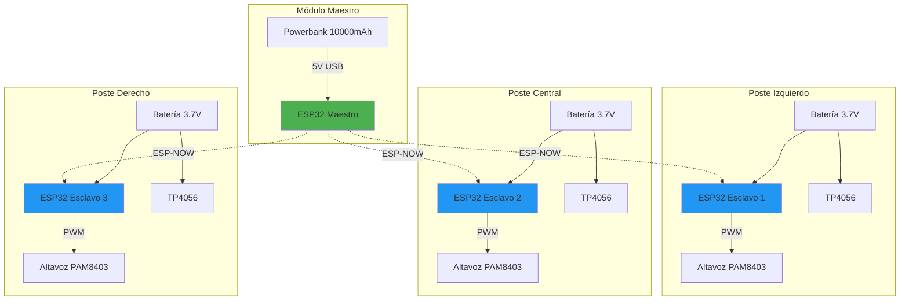

import { Callout } from 'fumadocs-ui/components/callout';

## Diagrama General del Sistema



## Módulo Maestro - Diagrama de Conexión

### Conexión Básica

```
┌─────────────────────┐
│   ESP32 DevKit V1   │
│                     │
│  ┌──────────────┐   │
│  │   USB Port   │───────→ Cable USB Micro-B
│  └──────────────┘   │         │
│                     │         │
│  [PIN Layout]       │         ↓
│  3V3  GND  EN  ...  │    ┌────────────┐
│  ...  ...  ... ...  │    │ Powerbank  │
└─────────────────────┘    │ 10000mAh   │
                           │  5V / 2A   │
                           └────────────┘
```

<Callout type="info">
El módulo maestro no requiere conexiones adicionales. Todo se maneja por USB: alimentación, programación y datos.
</Callout>

### Pines Utilizados (Maestro)

| Pin | Función | Descripción |
|-----|---------|-------------|
| 5V (USB) | Alimentación | Entrada de powerbank |
| GND | Tierra | Referencia común |
| GPIO2 | LED Indicador | LED integrado (interno) |
| TX/RX | UART | Para debugging serial (opcional) |

## Módulo Esclavo - Diagrama Detallado

### Esquema Completo de un Poste

```
                    ┌──────── Interruptor ON/OFF ────────┐
                    │                                    │
                    │                                    │
┌───────────────────┴────────┐         ┌────────────────┴───┐
│   Batería Li-Po 3.7V       │         │  Módulo TP4056     │
│   2000 mAh                 │         │  (Cargador)        │
│                            │         │                    │
│   [+]────────────────────┐ │         │  IN+ ←─ 5V USB    │
│   [-]───────┐            │ │         │  IN- ←─ GND USB   │
└─────────────│────────────│─┘         │                    │
              │            │           │  BAT+ ──→ Batería+│
              │            │           │  BAT- ──→ Batería-│
              │            │           └────────────────────┘
              │ GND        │ VCC (3.7-4.2V)
              │            │
              │            │
        ┌─────┴────────────┴───────┐
        │   ESP32 DevKit V1        │
        │                          │
        │  VIN ←─────── VCC        │
        │  GND ←─────── GND        │
        │                          │
        │  GPIO25 ──→ PWM Signal   │────────┐
        │  3V3 ───→ Amplifier VCC  │        │
        │  GND ───→ Amplifier GND  │        │
        └──────────────────────────┘        │
                                            │
                     ┌──────────────────────┘
                     │
        ┌────────────┴─────────────┐
        │  Amplificador PAM8403    │
        │                          │
        │  VCC ←── 3V3 (ESP32)    │
        │  GND ←── GND            │
        │  IN+ ←── GPIO25 (PWM)   │
        │  IN- ←── GND            │
        │                          │
        │  OUT+ ─────────┐        │
        │  OUT- ─────────│─────→  │
        └────────────────│────────┘
                         │
                    ┌────┴────┐
                    │ Speaker │
                    │   4Ω    │
                    │   3W    │
                    └─────────┘
```

### Tabla de Conexiones (Módulo Esclavo)

#### Batería → TP4056

| Batería | TP4056 Pin |
|---------|-----------|
| Positivo (+) | BAT+ |
| Negativo (-) | BAT- |

#### TP4056 → ESP32

| TP4056 | ESP32 Pin | Notas |
|--------|-----------|-------|
| OUT+ | VIN | Salida regulada de batería |
| OUT- | GND | Tierra común |

<Callout type="warn">
**Importante**: El TP4056 proporciona protección de batería. Si conectas la batería directamente al ESP32 sin protección, podrías dañarla por sobre-descarga.
</Callout>

#### ESP32 → Amplificador PAM8403

| ESP32 Pin | PAM8403 Pin | Descripción |
|-----------|-------------|-------------|
| 3V3 | VCC | Alimentación del amplificador |
| GND | GND | Tierra común |
| GPIO25 | IN+ (Left) | Señal PWM de audio |
| GND | IN- (Left) | Referencia para canal izquierdo |

#### Amplificador → Altavoz

| PAM8403 | Altavoz | Cable |
|---------|---------|-------|
| OUT+ | Terminal + | Rojo |
| OUT- | Terminal - | Negro |

## Diagrama Fritzing - Vista de Montaje

### Módulo Esclavo (Vista Breadboard)

```
         [Interruptor]
              │
         ─────┴─────
        │           │
    [Batería]   [TP4056]
    3.7V 2Ah        │
        │       [USB Micro]
        │           │
        └─────┬─────┘
              │
        ┌─────┴─────┐
        │  ESP32    │
        │           │
        │  [GPIO25]─┼──→ [PAM8403] ──→ [Speaker]
        │           │         │             4Ω
        │   [3V3]───┼──→ VCC  │
        │   [GND]───┼──→ GND  │
        └───────────┘
```

## Consideraciones de Cableado

### Longitud de Cables

| Conexión | Longitud Recomendada | Calibre |
|----------|----------------------|---------|
| Batería ↔ TP4056 | 10-15 cm | 22 AWG |
| TP4056 ↔ ESP32 | 15-20 cm | 22 AWG |
| ESP32 ↔ PAM8403 | 10-15 cm | 24 AWG |
| PAM8403 ↔ Speaker | 20-30 cm | 20 AWG |

<Callout type="info">
**Cables más cortos = Menos resistencia = Mejor eficiencia**

Mantén las conexiones lo más cortas posible, especialmente entre la batería y el ESP32.
</Callout>

### Colores Estándar

| Color | Uso |
|-------|-----|
| 🔴 Rojo | VCC / Positivo (+) |
| ⚫ Negro | GND / Negativo (-) |
| 🟡 Amarillo | Señal / PWM |
| 🟢 Verde | GPIO / Control |
| 🔵 Azul | Comunicación |

## Pinout Detallado ESP32 DevKit V1

```
                        ┌─────────┐
                        │   USB   │
                        └────┬────┘
   ┌────────────────────────┴────────────────────────┐
   │                                                  │
EN │○                                              ○│ 3V3
36 │○                                              ○│ GND
39 │○                                              ○│ 15
34 │○              ESP32                           ○│ 2
35 │○            DevKit V1                         ○│ 4
32 │○                                              ○│ 16
33 │○                                              ○│ 17
25 │○ ← (PWM Audio)                                ○│ 5
26 │○                                              ○│ 18
27 │○                                              ○│ 19
14 │○                                              ○│ 21
12 │○                                              ○│ 22
   │                                                  │
GND│○                                              ○│ TX
13 │○                                              ○│ RX
9  │○                                              ○│ 23
10 │○                                              ○│ VIN
11 │○                                              ○│ GND
   └──────────────────────────────────────────────┘
```

### Pines Específicos Usados

| Pin | Nombre | Función en GITAF | ADC/PWM |
|-----|--------|------------------|---------|
| GPIO25 | OUT | Señal PWM para audio | DAC2 ✓ |
| GPIO2 | LED | LED de estado (interno) | PWM ✓ |
| GPIO34 | IN | Monitoreo batería (opcional) | ADC1_6 ✓ |
| VIN | PWR | Entrada 5V desde USB/TP4056 | - |
| 3V3 | PWR | Salida regulada 3.3V | - |
| GND | PWR | Tierra común | - |

<Callout type="warn">
**Pines solo de entrada**: GPIO34, GPIO35, GPIO36, GPIO39 **no** tienen pull-up/pull-down interno y solo pueden usarse como entrada. No conectes LEDs o salidas a estos pines.
</Callout>

## Testing y Verificación

### Checklist Pre-Encendido

Antes de encender por primera vez, verifica:

- [ ] Polaridad correcta de batería (+/- no invertidos)
- [ ] No hay cortocircuitos entre VCC y GND
- [ ] Todas las soldaduras están aisladas
- [ ] Interruptor en posición OFF
- [ ] TP4056 está correctamente conectado
- [ ] Altavoz tiene la impedancia correcta (4Ω)
- [ ] Cables no están pellizcados o dañados

### Mediciones con Multímetro

| Punto de Prueba | Valor Esperado | Notas |
|----------------|----------------|-------|
| Batería sin carga | 3.7V - 4.2V | 4.2V = completamente cargada |
| Salida TP4056 | 3.7V - 4.2V | Igual que batería |
| ESP32 VIN | 3.7V - 4.2V | Desde TP4056 |
| ESP32 3V3 | 3.28V - 3.35V | Regulado interno |
| Continuidad GND | 0Ω | Todos los GND conectados |

## Montaje en Cajas

### Distribución Interna Recomendada

```
┌─────────────────────────────────┐
│  Tapa Superior                  │
│  [○ LED Estado] [○ Interruptor] │
├─────────────────────────────────┤
│                                 │
│  [ESP32]     [TP4056]          │
│                                 │
│  [PAM8403]   [Batería]         │
│                                 │
│  [Altavoz en panel lateral →]  │
│                                 │
├─────────────────────────────────┤
│  Base con velcro para montaje   │
└─────────────────────────────────┘
```

### Tips de Montaje

1. **Fijación**: Usa velcro adhesivo de doble cara
2. **Separación**: Mantén 1cm entre batería y ESP32 (ventilación)
3. **Acceso**: Mantén accesibles:
   - Puerto USB del TP4056 (para carga)
   - Botón de reset del ESP32
   - Interruptor de encendido
4. **Protección**: Aísla todas las soldaduras con termo encogible

## Recursos Adicionales

- [Datasheet ESP32](https://www.espressif.com/sites/default/files/documentation/esp32_datasheet_en.pdf)
- [PAM8403 Datasheet](https://www.diodes.com/assets/Datasheets/PAM8403.pdf)
- [TP4056 Manual](https://dlnmh9ip6v2uc.cloudfront.net/datasheets/Prototyping/TP4056.pdf)

## Próximos Pasos

- Configuración del [Entorno de Desarrollo](/docs/firmware/setup)
- Aprende sobre [Gestión de Energía](/docs/hardware/power)
- Resuelve problemas con [Troubleshooting](/docs/support/troubleshooting)
