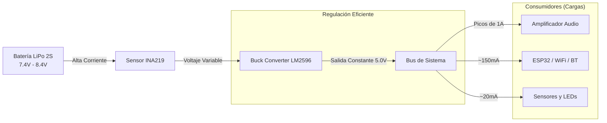

import { Callout } from 'fumadocs-ui/components/callout';

## Arquitectura de Potencia (7.4V)

A diferencia de sistemas portátiles estándar que operan a 3.7V, **GITAF PRO** utiliza un sistema de alimentación de **2 Celdas (2S)** para garantizar que el amplificador de audio reciba suficiente potencia sin distorsión.

### Diagrama de Flujo de Energía



## Telemetría de Batería (Sensor INA219)

El sistema descarta el método tradicional de lectura analógica (ADC) por ser impreciso. En su lugar, se utiliza un sensor digital **INA219** vía I2C.

### ¿Por qué INA219?

1. **Precisión:** Mide el voltaje con un error de ±10mV.
2. **Seguridad:** Permite monitorear tanto el voltaje (V) como el consumo de corriente (mA) en tiempo real.
3. **Independencia:** Libera al procesador ESP32 de realizar cálculos analógicos ruidosos.

### Algoritmo de Conversión (Firmware)

El código del sistema implementa un mapeo lineal para transformar el voltaje de una batería 2S en un porcentaje comprensible para el usuario.

```cpp
// Fragmento del código real del firmware GITAF
void checkAndSendBattery() {
  float busvoltage = ina219.getBusVoltage_V();   // Voltaje en carga
  float shuntvoltage = ina219.getShuntVoltage_mV();
  
  // Voltaje Total = Voltaje Bus + Caída en Shunt
  float loadvoltage = busvoltage + (shuntvoltage / 1000); 
  
  // Mapeo para Batería 2S (7.4V Nominal)
  // 6.4V = 0% (Descargada/Crítico)
  // 8.4V = 100% (Carga Completa)
  int pct = map(loadvoltage * 100, 640, 840, 0, 100);
  
  // Clamp para evitar valores ilógicos
  if (pct > 100) pct = 100; 
  if (pct < 0) pct = 0;

  // Transmisión
  sendTelemetry(pct);
}

```

## Perfil de Consumo Energético

El sistema GITAF PRO tiene un comportamiento dinámico. El consumo varía drásticamente dependiendo de si está emitiendo sonido o esperando comandos.

### Tabla de Consumo de Corriente

| Estado del Sistema | Consumo Promedio | Descripción |
| --- | --- | --- |
| **Standby (Espera)** | **80 mA - 110 mA** | ESP32 conectado a WiFi/BT, LM2596 activo, Audio silenciado. |
| **Reproducción (Vol 50%)** | **250 mA - 350 mA** | Sonido audible moderado. |
| **Reproducción (Vol 100%)** | **600 mA - 900 mA** | Picos de potencia en el amplificador PAM8403. |
| **Deep Sleep** | **< 20 mA** | (Futura implementación) Solo regulador activo. |

<Callout type="info">
El regulador LM2596 tiene una eficiencia del 92%. Esto significa que transforma el exceso de voltaje (8.4V) en corriente extra para el circuito de 5V, desperdiciando muy poco calor comparado con reguladores lineales.
</Callout>

## Estimación de Autonomía Real

Utilizando baterías LiPo estándar de **2000mAh (2S)**.

### Escenario: Entrenamiento Intensivo

* **Duración:** 2 Horas
* **Uso:** Disparos de audio frecuentes (cada 30 segundos).
* **Cálculo:**
* Tiempo Audio (10%): 0.2h * 600mA = 120mAh
* Tiempo Standby (90%): 1.8h * 100mA = 180mAh
* **Total Consumido:** ~300mAh
* **Batería Restante:** ~1700mAh (**85%**)


### Escenario: Torneo Completo (Jornada Larga)

* **Duración:** 8 Horas
* **Uso:** Disparos normales.
* **Consumo Estimado:** ~1200mAh
* **Resultado:** El sistema puede soportar una jornada completa de 8 horas sin necesidad de recarga (sobrando un 40% de batería como margen de seguridad).

## Estrategia de Ahorro "Inteligente"

Hemos implementado lógica de software para extender la duración de la batería sin sacrificar funcionalidad:

1. **Auto-Apagado de Audio:**
El firmware no permite que el audio suene indefinidamente. Tras **3 repeticiones** (aprox. 9 segundos), el sistema corta la señal al amplificador. Esto evita que un descuido del entrenador agote la batería.
2. **Reporte de Telemetría Intervalado:**
Los esclavos no transmiten datos WiFi continuamente. Solo envían su estado de batería cada **2 segundos**. Esto reduce el tiempo de uso de la antena de alta potencia.
3. **Alertas Preventivas:**
La App recibe alertas visuales:
* Verde: > 50%
* Naranja: > 20%
* Rojo: < 20% (Recomendación de carga inmediata)


## Instrucciones de Carga y Seguridad

Al usar baterías de litio de 2 celdas en serie, el protocolo de carga es estricto.

<Callout type="danger" title="Advertencia de Seguridad">
**NUNCA** intentes cargar el sistema conectando un cargador de celular (5V) al puerto USB del ESP32. El voltaje USB (5V) es **menor** que el de la batería (7.4V), por lo que no cargará.
</Callout>

### Procedimiento Correcto de Carga

1. **Desconexión:** Apague el interruptor general del sistema.
2. **Extracción (Recomendado):** Desconecte la batería LiPo utilizando el conector JST/T-Deans.
3. **Cargador Balanceado:** Utilice un cargador específico para LiPo 2S (7.4V) que balancee las celdas.
4. **Tiempo de Carga:** A 1 Amperio, una batería vacía tardará aproximadamente 2 horas en llegar al 100%.

### Protección Hardware

Aunque el código monitorea el voltaje, la batería LiPo incluye su propio circuito **BMS (Battery Management System)** interno que corta la energía si:

* Hay un cortocircuito.
* El voltaje baja de 6.0V (Sobredescarga).
* La corriente supera los 3A.