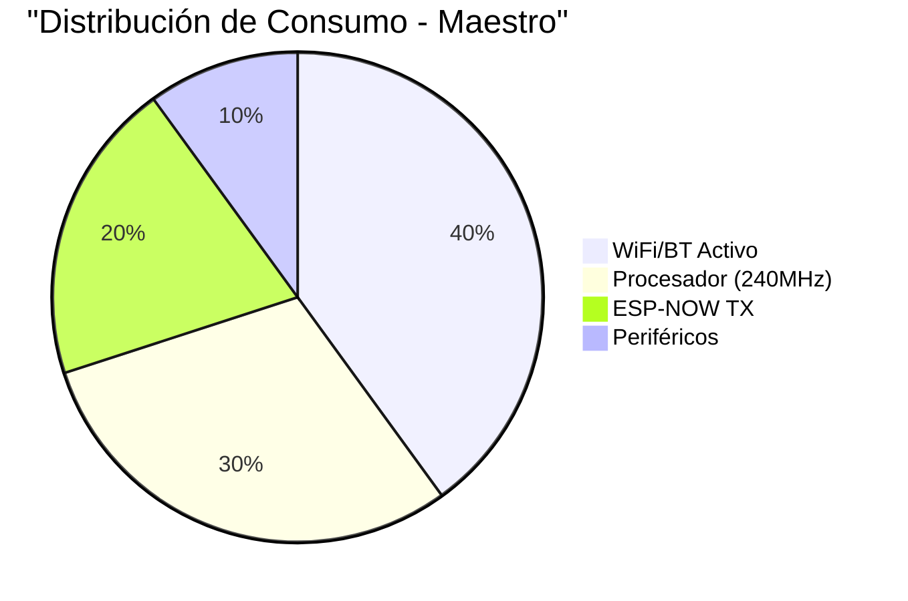
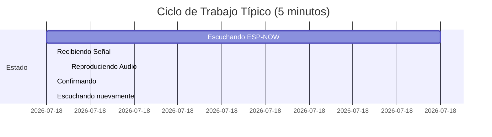

import { Callout } from 'fumadocs-ui/components/callout';

## Visión General del Consumo

El sistema GITAF está diseñado para funcionar de manera autónoma con baterías. La gestión eficiente de energía es crucial para maximizar el tiempo de operación.

### Resumen de Consumo por Módulo

| Módulo | Modo | Consumo | Duración Estimada |
|--------|------|---------|-------------------|
| **Maestro** | Activo | 120-150 mA | ~8-10 horas (10Ah) |
| | Standby | 40-60 mA | ~20-24 horas |
| **Esclavo** | Activo (audio) | 250-350 mA | ~6-8 horas (2Ah) |
| | Escuchando | 80-120 mA | ~16-20 horas |
| | Deep Sleep | 5-10 mA | ~200-400 horas |

## Módulo Maestro - Gestión de Energía

### Consumo Detallado

El ESP32 maestro consume energía en diferentes componentes:



#### Modos de Operación

**1. Modo Activo (Normal)**
- CPU a 240 MHz
- Bluetooth LE activo
- ESP-NOW en escucha
- Consumo: ~120-150 mA @ 3.3V
- Potencia: ~0.4-0.5W

**2. Modo Standby (Sin Conexión)**
- CPU a 80 MHz
- Bluetooth en low power
- ESP-NOW en sleep
- Consumo: ~40-60 mA @ 3.3V
- Potencia: ~0.15-0.2W

### Optimizaciones Implementadas

```cpp
// Reducción de frecuencia cuando no hay actividad
void reduceCPUFrequency() {
    setCpuFrequencyMhz(80);  // De 240MHz a 80MHz
    // Esto reduce el consumo en ~40%
}

// Bluetooth Low Energy con intervalos extendidos
void configureBLE() {
    BLEDevice::setPower(ESP_PWR_LVL_N12);  // -12dBm (bajo consumo)
    // Intervalo de advertising: 1000ms (en lugar de 100ms)
}

// ESP-NOW con duty cycle bajo
void configureESPNOW() {
    // Transmitir solo cuando hay comando
    // Modo promiscuo deshabilitado
    // Sin ACK para reducir overhead
}
```

<Callout type="info">
Al reducir la frecuencia del CPU a 80 MHz, el maestro puede durar hasta 24 horas en modo standby con un powerbank de 10,000 mAh.
</Callout>

## Módulo Esclavo - Gestión de Energía

### Perfil de Consumo

Los módulos esclavos tienen ciclos de trabajo más variados:



### Consumo por Estado

| Estado | Duración | Corriente | Carga (mAh) |
|--------|----------|-----------|-------------|
| Escuchando | 270s (90%) | 100 mA | 7.5 mAh |
| Audio ON | 15s (5%) | 300 mA | 1.25 mAh |
| Procesando | 15s (5%) | 150 mA | 0.625 mAh |
| **Total 5min** | **300s** | **~112 mA avg** | **9.375 mAh** |

Autonomía con batería 2000 mAh:
- **Uso continuo**: ~18 horas
- **Uso deportivo** (10% del tiempo en audio): ~35 horas

### Código de Optimización

```cpp
// Reducir consumo durante escucha
void optimizeListening() {
    // CPU a frecuencia mínima suficiente
    setCpuFrequencyMhz(80);  // 80MHz es suficiente para ESP-NOW
    
    // WiFi y Bluetooth OFF (no necesarios)
    WiFi.mode(WIFI_OFF);
    btStop();
    
    // Solo ESP-NOW activo
    esp_now_register_recv_cb(onDataRecv);
    
    // LED parpadeante cada 5s en lugar de constante
    blinkStatus(5000);
}

// Modo de bajo consumo agresivo (para transporte)
void enterDeepSleep() {
    esp_sleep_enable_timer_wakeup(60 * 1000000);  // Despertar cada 60s
    esp_deep_sleep_start();
    // Consumo: ~10 µA
}
```

### Audio con PWM Eficiente

El audio consume la mayor parte de la energía. Optimización:

```cpp
// Usar DAC en lugar de PWM donde sea posible
void setupEfficientAudio() {
    // DAC tiene mejor eficiencia que PWM de alta frecuencia
    dacWrite(25, 128);  // Centro del rango
    
    // Si usas PWM, limita la frecuencia
    ledcSetup(0, 8000, 8);  // 8kHz es suficiente para beacon
    ledcAttachPin(25, 0);
}

// Apagar amplificador cuando no está en uso
void shutdownAmplifier() {
    digitalWrite(AMPLIFIER_EN, LOW);  // Pin de enable a tierra
    // Ahorra ~50mA
}
```

## Circuito de Carga (TP4056)

### Especificaciones del TP4056

| Parámetro | Valor | Notas |
|-----------|-------|-------|
| Voltaje entrada | 5V ± 0.5V | USB estándar |
| Corriente carga | 1A (ajustable) | Con resistor Rprog |
| Eficiencia | ~85% | Típica |
| Protección | Sobrecarga, sobre-descarga, cortocircuito | ✓ |
| Tiempo carga 2Ah | ~2.5 horas | A 1A |

### LEDs Indicadores

| LED | Estado | Significado |
|-----|--------|-------------|
| Rojo ON | Cargando | Corriente fluyendo a batería |
| Rojo OFF, Azul ON | Completo | 4.2V alcanzado |
| Ambos OFF | Sin conexión | Revisar USB/batería |
| Rojo parpadeante | Error | Temperatura/batería defectuosa |

<Callout type="warn">
**Importante**: No uses la batería mientras está cargando a altas corrientes (>0.5A). Esto puede acortar su vida útil.
</Callout>

### Ajuste de Corriente de Carga

El TP4056 incluye una resistencia Rprog que determina la corriente:

| Rprog | Corriente de Carga |
|-------|-------------------|
| 10kΩ | 130 mA (lento) |
| 5kΩ | 250 mA |
| 2kΩ | 580 mA |
| 1.2kΩ | 1000 mA (estándar) |
| 1kΩ | 1200 mA (rápido) |

Para baterías de 2000 mAh:
- **Recomendado**: 1A (0.5C) - Balance entre velocidad y vida útil
- **Rápido**: 2A (1C) - Solo si la batería lo soporta
- **Lento**: 500mA (0.25C) - Máxima vida útil

## Monitoreo de Batería

### Medición de Voltaje

Puedes monitorear el nivel de batería con el ADC del ESP32:

```cpp
#define BATTERY_PIN 34  // GPIO34 es solo entrada (ADC1_CH6)

float readBatteryVoltage() {
    // Leer ADC (0-4095 para 0-3.3V)
    int adcValue = analogRead(BATTERY_PIN);
    
    // Convertir a voltaje
    // Nota: Agregar divisor de voltaje 2:1 si batería > 3.3V
    float voltage = (adcValue / 4095.0) * 3.3 * 2.0;
    
    return voltage;
}

int getBatteryPercentage(float voltage) {
    // Curva de descarga Li-Po
    if (voltage >= 4.2) return 100;
    if (voltage >= 4.0) return 80;
    if (voltage >= 3.8) return 60;
    if (voltage >= 3.6) return 40;
    if (voltage >= 3.4) return 20;
    if (voltage >= 3.2) return 10;
    return 0;  // <3.0V está crítico
}
```

### Divisor de Voltaje (Necesario)

Para medir baterías de 4.2V con ADC de 3.3V:

```
Batería (+4.2V) ──┬── R1 (100kΩ) ──┬── R2 (100kΩ) ──┬── GND
                  │                 │                │
                               GPIO34 (ADC)
                               
Voltaje medido = Vbat * R2/(R1+R2) = Vbat * 0.5
```

<Callout type="info">
Si no agregas el divisor de voltaje, puedes dañar el ESP32. La máxima entrada del ADC es 3.6V.
</Callout>

## Protecciones de Batería

### Límites Operacionales

| Parámetro | Valor Mínimo | Valor Máximo | Acción |
|-----------|--------------|--------------|--------|
| Voltaje | 3.0V | 4.2V | Shutdown automático |
| Temperatura | 0°C | 45°C | Reducir carga |
| Corriente carga | - | 2A (1C) | Limitador TP4056 |
| Corriente descarga | - | 4A (2C) | PCM de batería |

### Implementación en Código

```cpp
void checkBatteryHealth() {
    float voltage = readBatteryVoltage();
    
    // Alertas por nivel bajo
    if (voltage < 3.3) {
        // CRÍTICO: <10% batería
        blinkLED(100);  // Parpadeo rápido
        sendLowBatteryAlert();
        
        if (voltage < 3.0) {
            // APAGADO INMEDIATO
            shutdownSafely();
            esp_deep_sleep_start();
        }
    }
    
    // Alerta nivel medio
    if (voltage < 3.6) {
        // <40% batería
        reduceSamplingRate();  // Optimizar aún más
    }
}

void shutdownSafely() {
    // Guardar configuración en NVS
    saveConfigToNVS();
    
    // Apagar audio
    digitalWrite(AMPLIFIER_EN, LOW);
    
    // Apagar LEDs
    digitalWrite(LED_PIN, LOW);
    
    // Mensaje final
    Serial.println("Low battery shutdown");
    delay(100);
}
```

## Estrategias de Ahorro Avanzadas

### 1. ESP-NOW Modem Sleep

```cpp
void enableESPNOWsleep() {
    // Activar modem sleep automático
    esp_wifi_set_ps(WIFI_PS_MIN_MODEM);
    
    // Reduce consumo ~20-30% cuando no transmite
}
```

### 2. Light Sleep entre Recepciones

```cpp
void lightSleepBetweenPackets() {
    // Dormir por intervalos cortos
    esp_sleep_enable_timer_wakeup(100000);  // 100ms
    esp_light_sleep_start();
    
    // Despierta rápido (<1ms), ahorra energía
}
```

### 3. Dynamic Frequency Scaling

```cpp
void dynamicCPUscaling(bool highPerformance) {
    if (highPerformance) {
        setCpuFrequencyMhz(240);  // Máximo rendimiento
    } else {
        setCpuFrequencyMhz(80);   // Ahorro energía
    }
}
```

## Tabla de Autonomía Completa

### Basado en Uso Real

| Escenario | Powerbank Maestro | Batería Esclavo | Duración |
|-----------|-------------------|-----------------|----------|
| **Entrenamiento** | 10,000 mAh | 2,000 mAh | 6-8 horas |
| Uso moderado (50%) | ↓ | ↓ | 12-15 horas |
| Solo standby | ↓ | ↓ | 24-30 horas |
| Deep sleep transporte | ↓ | ↓ | >1 mes |

### Cálculos Detallados (Esclavo)

**Sesión de entrenamiento típica (2 horas)**:
- Escuchando: 100 mA × 108 min = 180 mAh
- Audio activo: 300 mA × 12 min = 60 mAh  
- Total consumido: **240 mAh**
- Batería restante: 2000 - 240 = **1760 mAh (88%)**

**Entrenamientos por carga**: ~8-10 sesiones de 2 horas

## Recomendaciones Finales

### Mejores Prácticas

✅ **Hacer**:
- Cargar baterías después de cada uso
- Almacenar a 50-60% de carga (3.7-3.8V)
- Usar protección TP4056 siempre
- Monitorear voltaje regularmente
- Mantener temperatura ambiente (15-25°C)

❌ **No Hacer**:
- Descargar por debajo de 3.0V
- Cargar por encima de 4.3V
- Exponer a temperaturas extremas
- Cargar rápido (>1C) frecuentemente
- Dejar conectado a carga indefinidamente

### Vida Útil de las Baterías

Con cuidado apropiado:
- **Ciclos de vida**: 500-800 ciclos
- **Años de uso**: 2-4 años (2-3 sesiones/semana)
- **Degradación**: 20% capacidad después de 2 años

<Callout type="info">
Reemplaza las baterías cuando su capacidad caiga por debajo del 70% (1400 mAh efectivo). Esto garantiza autonomía confiable.
</Callout>

## Troubleshooting de Energía

Consulta la sección [Solución de Problemas](/docs/support/troubleshooting#energia) para diagnóstico de:
- Batería no carga
- Descarga rápida inexplicable
- ESP32 se reinicia aleatoriamente
- TP4056 con LEDs anormales

## Recursos

- [Datasheet Li-Po](https://cdn-shop.adafruit.com/datasheets/LiPoCare.pdf)
- [TP4056 Application Notes](https://dlnmh9ip6v2uc.cloudfront.net/datasheets/Prototyping/TP4056.pdf)
- [ESP32 Power Management](https://docs.espressif.com/projects/esp-idf/en/latest/esp32/api-reference/system/power_management.html)
