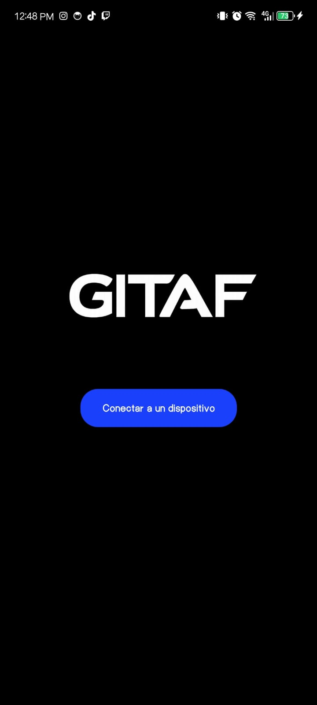
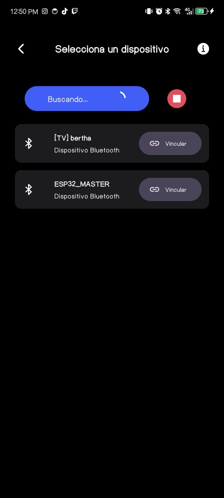
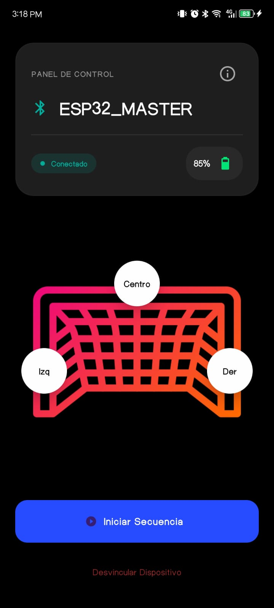
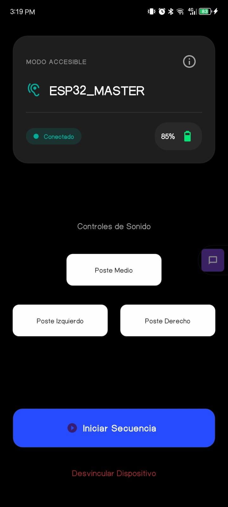

import { Cards, Card } from 'fumadocs-ui/components/card';

En este apartado se verán todas las pantallas con las que cuenta la app mobile de GITAF.

<Cards>
  <Card title="1. Pantalla de Inicio" href="#">
    Una pantalla muy simple la cual permite al usuario redirigir a la pantalla de conexión, mostrando el logo como principal atractivo visual.
    
  </Card>
  
  <Card title="2. Pantalla de Conexión" href="#">
    En esta pantalla el usuario podrá comenzar el escanéo de todos los dispositivos **Bluetooth** cercanos, eligiendo así el dispositivo **ESP-32** entre la lista de dispositivos.
    
  </Card>

  <Card title="3. Pantalla de Control" href="#">
    Esta pantalla es de uso exclusivo para personas videntes o con discapacidad visual parcial. En esta pantalla el usuario podrá seleccionar la ubicación en la cual se desea reproducir el sonido, 
    teniendo 3 opciones como principales (Derecha, Centro e Izquierda). 
    
  </Card>

  <Card title="4. Pantalla de Control en modo TalkBack" href="#">
    Esta pantalla es de uso exclusivo para personas no videntes, estilizada con un diseño simple y funcional, así mismo permitiendo al usuario escoger en qué dirección quiere que se reproduzca un sonido.
    No es necesario seleccionarla manualmente, la aplicación detecta si el usuario tiene activado TalkBack en su dispositivo y redirige automáticamente a la pantalla de Control en modo TalkBack.
    
  </Card>
</Cards>