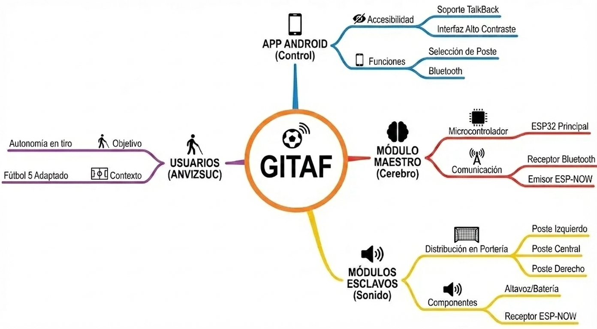

## Diagrama de Funcionalidad

El diagrama presentado ilustra la estructura funcional del **Sistema de Orientación Audible (GITAF)**. Esta solución tecnológica está diseñada para dotar de autonomía a los deportistas con discapacidad visual durante la práctica del Fútbol 5 Adaptado.

## Explicaciones técnicas

### 1. Interfaz de Control (App Android)
El punto de entrada al sistema es una aplicación móvil que prioriza la **accesibilidad universal**, incorporando soporte nativo para **TalkBack** y una interfaz de alto contraste. Permite seleccionar el poste (Izquierdo, Central, Derecho) y gestionar la conexión Bluetooth.

### 2. Módulo Maestro (El Cerebro)
El núcleo del procesamiento. Equipado con un **ESP32 Principal** que cumple doble función:
- **Receptor Bluetooth:** Recibe instrucciones de la App.
- **Emisor ESP-NOW:** Traduce y envía señales inalámbricas a los postes.

### 3. Módulos Esclavos (Sonido)
Ubicados en la portería. Cada módulo funciona independientemente con un **Receptor ESP-32**, mediante el protocolo **ESP-NOW**, un altavoz para la señal acústica y una batería propia, eliminando el uso de cables.

### 4. Usuarios y Contexto
El diseño responde a las necesidades de **ANVIZSUC**, con el objetivo de mejorar la autonomía en el tiro y la orientación espacial sin depender de un guía humano.

<Cards>
  <Card title="Ver Antecedentes" href="https://github.com/tu-usuario/repo" />
  <Card title="Documentación Técnica" href="/docs/technical" />
</Cards>